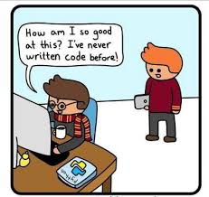

# Chapter 0: What is Programming? - The Magic Begins! ✨

## 🎭 Kinan's Story

Kinan sat in front of his computer, playing his favorite game. "Wow," he thought, "how do people create these amazing worlds? How can I tell this metal box what to do? It only understands electricity and 1s and 0s, but I speak English!"

This is where our adventure begins. Kinan discovered something incredible: **Programming** - the bridge between human thinking and computer understanding.

## 🧠 What is Programming?

**Programming** is like teaching a very smart but very literal-minded robot how to do tasks. Think of it like writing a recipe:

### Real-World Recipe vs Computer Recipe

**Cooking Recipe:**
1. Take 2 eggs
2. Beat them with a fork
3. Pour into a hot pan
4. Cook for 3 minutes

**Computer Recipe (Code):**
```python
take_eggs(2)
beat_with("fork")
pour_into("hot_pan")
cook_for("3_minutes")
```

The computer needs *exact* instructions. It can't guess what you mean!

## 🔄 From Your Ideas to Computer Actions

Here's the amazing journey your instructions take:

```
Your Idea → Python Code → Python Translator → Machine Code → Computer Action!
    ↓           ↓              ↓                ↓              ↓
"I want to   print("Hello")  Python reads     10110101       Screen shows
say hello"                    this and          + 11001101     "Hello"
                             understands       = 10000010
                             what to do
```

### What's Happening Behind the Scenes?

1. **Your Brain**: Has ideas in human language
2. **Python Code**: Write your ideas using Python's special rules
3. **Python Interpreter**: Translates your code into computer language
4. **Machine Code**: The computer's native language (1s and 0s)
5. **Computer Action**: The computer does exactly what you asked!

## 🤔 Why Python?

Python is like the "universal translator" of programming languages. Here's why it's perfect for beginners:

### English-Like and Readable
```python
# Python - Almost like English!
if age >= 13:
    print("You can take this course!")
else:
    print("Wait a few more years!")
```

Compare this to other languages:
```c
// C - Much more complicated!
if (age >= 13) {
    printf("You can take this course!");
} else {
    printf("Wait a few more years!");
}
```


## 💻 What Can You Create with Programming?

- **Games**: Like the ones you love to play!
- **Apps**: Tools that help people solve problems
- **Websites**: Places where people share information
- **Robots**: Machines that do physical tasks
- **Art**: Creative visual designs and animations
- **And so much more!**

## 🎮 What Kinan Discovered

Kinan learned that programming isn't about being a math genius or computer expert. It's about:

1. **Problem Solving**: Breaking big problems into small steps
2. **Creativity**: Finding different ways to solve the same problem
3. **Logic**: Thinking step-by-step
4. **Patience**: Learning from mistakes and trying again

## 🚀 Your First Programming Mindset

### The Programmer's Promise
When you write code, you're making a promise to the computer:
- "If you do X, then I promise Y will happen"
- "For each of these items, do this action"
- "Remember this information for later"

### The Computer's Personality
Computers are:
- **Super Fast**: They can do millions of calculations per second
- **Super Literal**: They do EXACTLY what you say, not what you mean
- **Super Patient**: They'll run your code 1000 times without complaining
- **Super Unforgiving**: One small mistake and they stop working

## 🔧 Setting Up Your Programming Workshop

Before we start building, let's make sure you have your tools ready:

1. **Python Installed**: The language we'll speak
2. **Code Editor**: Where we'll write our instructions
3. **Terminal**: Where we'll run our programs

*(Check the `setup.md` file in this folder for installation instructions!)*

## 🎯 What You'll Learn in This Chapter

By the end of this chapter, you'll understand:
- What programming actually is
- How computers understand our instructions
- Why Python is a great first language
- The mindset needed to become a programmer

## 📚 Activity: Think Like a Computer!

Try writing instructions for making a peanut butter sandwich. Be VERY specific. Then ask someone to follow your instructions exactly. Did they do what you expected?

This is what programming feels like - being super precise!

## 🚀 Next Chapter Preview

Now that Kinan understands what programming is, he's ready to write his very first program and make the computer say "Hello!" Join us in Chapter 1: **"Hello, Computer!"**

---

> 💡 **Remember**: Every professional programmer was once exactly where you are now - curious and excited to learn. The journey of a thousand lines of code begins with a single `print("Hello!")`