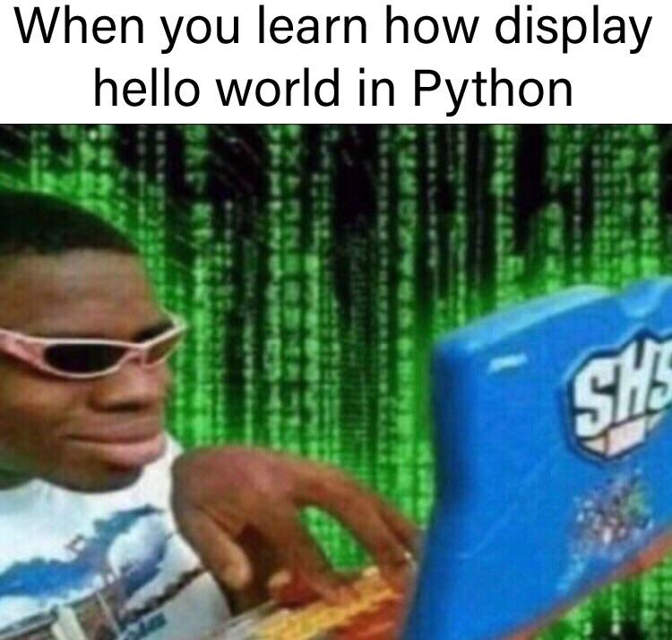

# Chapter 1: Hello, Computer! - Your First Words ✨

## 🎭 Kinan's Story

Kinan understood what programming was, but now he faced a new challenge: "How do I actually talk to this computer? I want to make it say something back to me!"

He sat down, took a deep breath, and wrote his very first line of code. When he ran it, something magical happened...

## 🌟 Your First Python Program

Let's start with the classic "Hello, World!" - every programmer's first step!

```python
print("Hello, Computer! I'm learning to talk to you!")
```


**Run this code and see what happens!** 🎉

### What Just Happened?

- `print()` is a **function** - it's a command that tells Python to display something
- `"Hello, Computer!"` is a **string** - text that we want to display
- The parentheses `()` hold the information we want to print

## 💬 Talking with the Computer

### More Ways to Say Hello

```python
print("Hello!")
print('I can use single quotes too!')
print("And I can even combine:", "Hello", "World!")
```

### Making the Computer Do Math

```python
print("2 + 2 =", 2 + 2)
print("10 - 3 =", 10 - 3)
print("5 * 4 =", 5 * 4)
print("15 / 3 =", 15 / 3)
```

### Fun with Text

```python
print("Ha" * 5)  # This will print "HaHaHaHaHa"
print("🎮" * 3)  # This will print "🎮🎮🎮"
```

## 🔍 Understanding Python's Grammar

Just like English has rules (grammar), Python has rules too. Let's learn them!

### Rule 1: Every Instruction is a Line
```python
print("First line")
print("Second line")
print("Third line")
```

### Rule 2: Text Goes in Quotes
```python
print("This works!")     # ✅ Good
print('This also works!') # ✅ Good
print(This breaks!)       # ❌ Bad - no quotes!
```

### Rule 3: Python Reads from Top to Bottom
```python
print("I appear first")
print("I appear second")
print("I appear last")
```

## 🤖 Getting Input from the User

What if the computer wants to talk back to us?

```python
name = input("What's your name? ")
print("Hello,", name, "! Nice to meet you! 🎉")
```

### What's Happening Here?

1. `input("What's your name? ")` asks the user a question and waits for their answer
2. The answer gets stored in the `name` variable (we'll learn about variables in the next chapter)
3. `print("Hello,", name, "!")` displays a greeting using their name

## 🎮 Mini Project 1: Your First Interactive Program

Let's create a program that introduces itself and learns about you!

```python
# program_introduction.py
print("🤖 Hi! I'm your first Python program!")
print("I'm excited to learn with you!")

# Get user's name
your_name = input("What should I call you? ")
print("Nice to meet you,", your_name, "!")

# Get user's favorite game
favorite_game = input("What's your favorite video game? ")
print("Oh,", favorite_game, "sounds awesome!")

# Get user's age
age = input("How old are you? ")
print("Wow,", age, "is a great age to start programming!")

print("Let's learn Python together and create some amazing games! 🚀")
```

## 🎯 Mini Project 2: A Simple Story

Let's create a program that tells an interactive story!

```python
# story_generator.py
print("📚 Let's create a story together!")
print()

character_name = input("What's the main character's name? ")
place = input("Where does the story happen? ")
magical_item = input("What magical item does the character find? ")

print()
print("🌟 YOUR STORY 🌟")
print("Once upon a time, there was a brave programmer named", character_name + ".")
print(character_name, "was coding in a magical place called", place + ".")
print("Suddenly, they found a mysterious", magical_item + "!")
print("The", magical_item, "glowed and gave", character_name, "amazing programming powers!")
print("And they coded happily ever after! The End! 🎉")
```

## 🔤 Working with Text (Strings)

Python makes text manipulation fun and easy!

### Combining Text
```python
first_name = "Kinan"
last_name = "Coder"
full_name = first_name + " " + last_name
print(full_name)  # Output: Kinan Coder
```

### Text Length
```python
message = "Python is fun!"
print(len(message))  # Output: 14
```

### Making Text Uppercase/Lowercase
```python
shouting = "hello world"
print(shouting.upper())  # Output: HELLO WORLD

whispering = "THIS IS LOUD"
print(whispering.lower())  # Output: this is loud
```

## 🧪 Try These Challenges!

### Challenge 1: The Greeter Bot
Create a program that:
1. Asks for the user's name
2. Asks for their favorite color
3. Prints a personalized greeting message

### Challenge 2: Math Quiz
Create a program that:
1. Asks for two numbers
2. Prints their sum, difference, product, and division

### Challenge 3: Word Art
Create a program that prints a cool pattern using text repetition:
```
* * * * *
* * * * *
* * * * *
```

## 🐛 Common Mistakes (Don't Worry, Everyone Makes Them!)

### Mistake 1: Forgetting Quotes
```python
print(Hello World)  # ❌ This will cause an error
print("Hello World") # ✅ This works!
```

### Mistake 2: Mismatched Quotes
```python
print("Hello')  # ❌ Mismatched quotes
print("Hello")  # ✅ Matching quotes
print('Hello')  # ✅ Also matching quotes
```

### Mistake 3: Misspelling `print`
```python
pint("Hello")   # ❌ Misspelled
print("Hello")  # ✅ Correct spelling
```

## 🎉 Chapter Complete!

**Congratulations!** 🎊 You've just written your first Python programs! You now know:

- ✅ How to make the computer display text
- ✅ How to get input from users
- ✅ How to do basic math in Python
- ✅ How to combine text and create simple programs
- ✅ Python's basic grammar rules

## 🚀 What's Next?

Kinan was excited! He could now talk to the computer, but he wanted to remember things. "How do I store information?" he wondered.

Join us in Chapter 2: **"Variables - Your Computer's Memory"** where Kinan discovers how to make his computer remember things!

---

> 💡 **Remember**: Every expert was once a beginner. Your first programs might be simple, but they're your first steps on an amazing journey! Keep coding, keep experimenting, and most importantly, have fun! 🎮