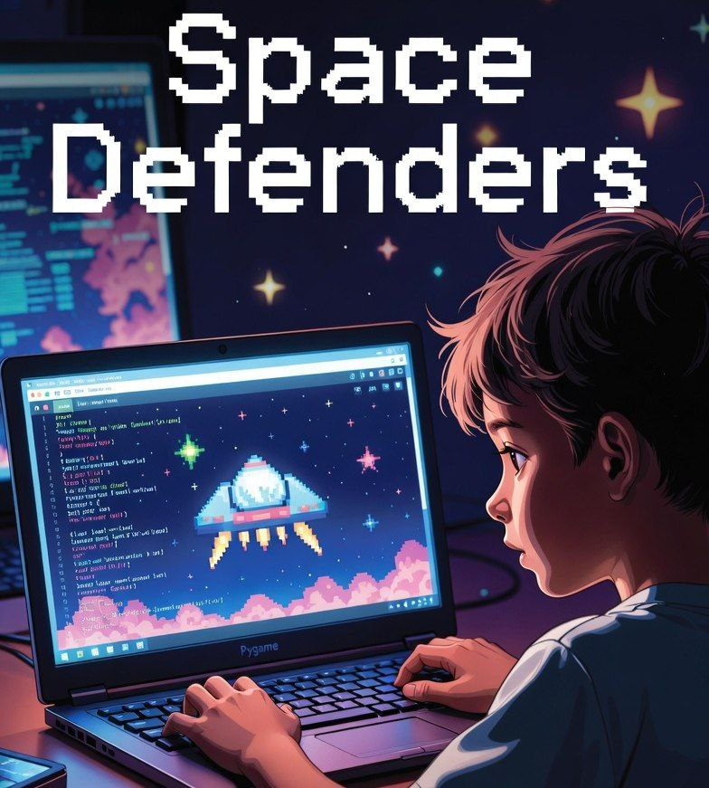

```
██╗░░░░░███████╗░█████╗░██████╗░███╗░░██╗  ██████╗░██╗░░░██╗████████╗██╗░░██╗░█████╗░███╗░░██╗
██║░░░░░██╔════╝██╔══██╗██╔══██╗████╗░██║  ██╔══██╗╚██╗░██╔╝╚══██╔══╝██║░░██║██╔══██╗████╗░██║
██║░░░░░█████╗░░███████║██████╔╝██╔██╗██║  ██████╔╝░╚████╔╝░░░░██║░░░███████║██║░░██║██╔██╗██║
██║░░░░░██╔══╝░░██╔══██║██╔══██╗██║╚████║  ██╔═══╝░░░╚██╔╝░░░░░██║░░░██╔══██║██║░░██║██║╚████║
███████╗███████╗██║░░██║██║░░██║██║░╚███║  ██║░░░░░░░░██║░░░░░░██║░░░██║░░██║╚█████╔╝██║░╚███║
╚══════╝╚══════╝╚═╝░░╚═╝╚═╝░░╚═╝╚═╝░░╚══╝  ╚═╝░░░░░░░░╚═╝░░░░░░╚═╝░░░╚═╝░░╚═╝░╚════╝░╚═╝░░╚══╝

░██╗░░░░░░░██╗██╗████████╗██╗░░██╗  ██╗░░██╗██╗███╗░░██╗░█████╗░███╗░░██╗
░██║░░██╗░░██║██║╚══██╔══╝██║░░██║  ██║░██╔╝██║████╗░██║██╔══██╗████╗░██║
░╚██╗████╗██╔╝██║░░░██║░░░███████║  █████═╝░██║██╔██╗██║███████║██╔██╗██║
░░████╔═████║░██║░░░██║░░░██╔══██║  ██╔═██╗░██║██║╚████║██╔══██║██║╚████║
░░╚██╔╝░╚██╔╝░██║░░░██║░░░██║░░██║  ██║░╚██╗██║██║░╚███║██║░░██║██║░╚███║
░░░╚═╝░░░╚═╝░░╚═╝░░░╚═╝░░░╚═╝░░╚═╝  ╚═╝░░╚═╝╚═╝╚═╝░░╚══╝╚═╝░░╚═╝╚═╝░░╚══╝
```


# 🎮 Python Adventure: From Zero to Game Developer

## Welcome, Future Programmer! 🚀

### Meet Kinan 👦
Kinan was curious about computers. He loved playing games, but wondered: *How do people create these amazing worlds? How can I tell a computer what to do?*

If you're like Kinan, you're in the right place! This course will take you from knowing nothing about programming to creating your very own games.





## 🎯 What You'll Learn

This isn't just another boring programming course. We're going on an adventure where each chapter solves a real problem that Kinan faces:

- **Chapter 0**: How do computers even understand us? (The Magic of Programming)
- **Chapter 1**: Your first conversation with a computer! (Hello, World!)
- **Chapter 2**: How to remember things (Variables & Memory)
- **Chapter 3**: Making smart choices (If-Else Decisions)
- **Chapter 4**: Doing things over and over (Loops)
- **Chapter 5**: Building reusable tools (Functions)
- **Chapter 6**: Organizing lots of information (Lists & Dictionaries)
- **Chapter 7**: Creating your own objects (Classes & OOP)
- **Chapter 8**: Drawing on screen! (Pygame Introduction)
- **Chapter 9**: Making things interactive (Game Mechanics)
- **Chapter 10**: Your complete game! (Final Project)

## 🏗️ How This Course Works

Each chapter follows the same pattern:
1. **The Problem**: What challenge is Kinan facing?
2. **The Concept**: What programming concept solves it?
3. **The Code**: Hands-on examples and mini-projects
4. **The Challenge**: Practice problems to reinforce learning
5. **The Story**: How Kinan uses this new knowledge

## 🎮 By The End, You'll Have Created:

- A text-based adventure game
- A simple calculator
- A guessing game
- An animated character that moves around
- **Your very own complete video game! SPACE DEFENDERS**

## 📋 Prerequisites

- Curiosity and willingness to learn
- A computer (you're already using one!)
- Some time to grasp information !
- No prior programming experience needed!

## 🚀 Let's Start!

Ready to begin your adventure? Head to **Chapter 0** and discover the magic of programming!

---

> 💡 **Remember**: Every expert was once a beginner. Kinan started with no knowledge, and step by step, he became a game developer. You can too!

---

*"The best way to predict the future is to create it."* - Peter Drucker


